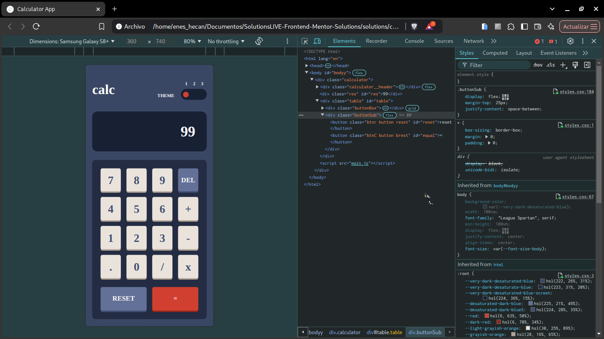

<div align="center">

  

  <h2 align="center">Calculator App Main
</h2>
  <p align="center">
    <a href="https://www.frontendmentor.io/challenges/expenses-chart-component-e7yJBUdjwt" target="_blank"><strong>Frontend Mentor Challenge</strong></a>
    <br />
    <br />
    <a href="https://johanxtheking.github.io/SolutionsLIVE-Frontend-Mentor-Solutions/solutions/calculator-app-main/">Ver demo</a>
    &nbsp;·&nbsp;
    <a href="https://github.com/JohanXTheKing/SolutionsLIVE-Frontend-Mentor-Solutions/issues" target="_blank">Report bug</a>
    &nbsp;·&nbsp;
    <a href="https://github.com/JohanXTheKing/SolutionsLIVE-Frontend-Mentor-Solutions/issues"target="_blank">Request Feature</a>
  </p>
</div>

<!-- Badges -->
<div align="center">
  <!-- Profiles -->
  <a href="https://www.frontendmentor.io/profile/JohanXTheKing" target="_blank">
    
  </a> &nbsp;&nbsp;&nbsp;

  <!-- Status -->
  <a href="#">
    
  </a> &nbsp;&nbsp;&nbsp;

  <!-- Difficulty -->
  <a href="https://www.frontendmentor.io/challenges?difficulties=1"  target="_blank">
    
  </a>

</div>
<br />
<br />


## **Preview**

<div align='center'>

</div>


<br>

## **Links**

  |||
  | :----- | :----- |
  | Solution URL: | [------>](https://github.com/JohanXTheKing/SolutionsLIVE-Frontend-Mentor-Solutions/tree/main/solutions/calculator-app-main) |
  | Live Site URL: | [------>](https://johanxtheking.github.io/SolutionsLIVE-Frontend-Mentor-Solutions/solutions/calculator-app-main/) |
  |||


<br>


## Cap

<div align='center'>

</div>

## What i learned

```js
function calculate()
{
    let result;
    const num1 = parseFloat(firstNumber);
    const num2 = parseFloat(secondNumber);

    switch (operation)
    {
        case '+':
            result = num1 + num2;
            break;
        case '-':
            result = num1 - num2;
            break;
        case '*':
            result = num1 * num2;
            break;
        case '/':
            result = num1 / num2;
            break;
        default:
            return;
    }

    updateDisplay(result);
    firstNumber = result.toString();
    secondNumber = '';
    operation = '';
}
  ```


## **Built With**

<div align= "center">

   

</div>

<br>

## **Tools Used**

<div align= "center">


    
  
     

</div>

## **Let's Connect 👋**

<div align=center>
<a href="https://www.instagram.com/giio_joo_xtx/" target="_blank">
        
    </a>

  <a href="https://www.frontendmentor.io/profile/JohanXTheKing" target="_blank">
    
  </a>

  <a href="https://github.com/JohanXTheKing" target="_blank">
    
  </a>

</div>

<br>