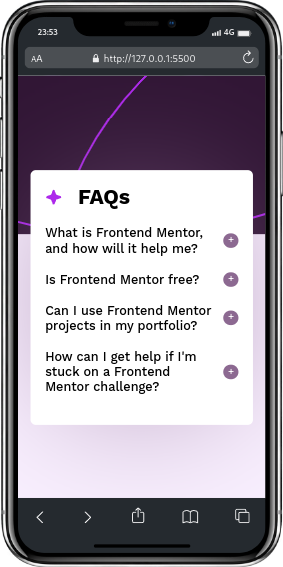

# FAQ accordion solution

<p align="center">
  <a href="https://johanxtheking.github.io/SolutionsLIVE-Frontend-Mentor-Solutions/solutions/faq-accordion-main/">Ver demo</a> -
   <a href="https://github.com/JohanXTheKing/SolutionsLIVE-Frontend-Mentor-Solutions/issues">Report bug</a> -
  <a href="https://github.com/JohanXTheKing/SolutionsLIVE-Frontend-Mentor-Solutions/issues">Request Feature</a>
</p>

## Preview


## Screenshot(For mobil)



## Links

- Solution URL: [INDEX.HTML](https://www.frontendmentor.io/solutions/my-solution-for-challenge-newslettersignupwithsuccessmessagema-8hGCSmReky)


- Live Site URL: [FAQ accordion main](https://johanxtheking.github.io/SolutionsLIVE-Frontend-Mentor-Solutions/solutions/faq-accordion-main/)

# My process

## Built with
*  

* 
* 

##  What I learned
```html
<div class="faqz">
    <div class="label">
        What is Frontend Mentor, and how will it help me?
    </div>
    <div class="content">
    <p>
    Frontend Mentor offers realistic coding challenges to help developers improve their 
    frontend coding skills with projects in HTML, CSS, and JavaScript. It's suitable for 
    all levels and ideal for portfolio building.
    </p>          
    </div>
</div>
```
```css
.container_faqs .faqz .content
{
    position: relative;
    overflow: hidden;
    transition: .5s;
    height: 0;
    overflow: auto;
    color: var(--GrayishPurple);
}
.container_faqs .faqz.active .content
{
    height: auto;
    padding: .5rem 0 2.5rem 0;
}
```
```js
const accordeon = document.getElementsByClassName('faqz');
for(i = 0 ; i < accordeon.length; i++)
{
    accordeon[i].addEventListener('click', function(){
        this.classList.toggle('active')
    })
}
}
```

## Tools Used

*   
*   
*  
*  
*  
