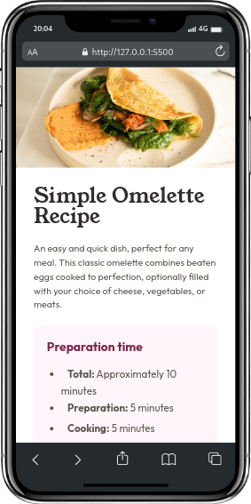

# Recipe page main (Solution)

  <a href="https://johanxtheking.github.io/SolutionsLIVE-Frontend-Mentor-Solutions/solutions/recipe-page-main/">Ver demo</a> -
   <a href="https://github.com/JohanXTheKing/SolutionsLIVE-Frontend-Mentor-Solutions/issues">Report bug</a> -
  <a href="https://github.com/JohanXTheKing/SolutionsLIVE-Frontend-Mentor-Solutions/issues">Request Feature</a>

## Preview

## Screenshot

## Links

- Solution URL: [INDEX.HTML]([https://github.com/JohanXTheKing/SolutionsLIVE-Frontend-Mentor-Solutions/tree/main/solutions/recipe-page-main](https://www.frontendmentor.io/solutions/simple-omelette-recipe-solution-using-flex-and-grid-9qqeHFSAiX))

- Live Site URL: [Recipe Page Main](https://johanxtheking.github.io/SolutionsLIVE-Frontend-Mentor-Solutions/solutions/recipe-page-main/#)

# My process

## Built with
*  

* 
* 

## Tools Used

*   
*   
*  
*  
*  
