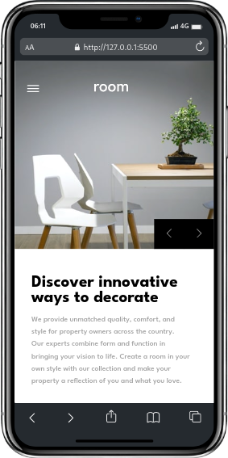

# Frontend Mentor - Room homepage solution
<p align="center">
  <a href="https://johanxtheking.github.io/SolutionsLIVE-Frontend-Mentor-Solutions
/solutions/room-homepage-master">Ver demo</a> -
   <a href="https://github.com/JohanXTheKing/SolutionsLIVE-Frontend-Mentor-Solutions/issues">Report bug</a> -
  <a href="https://github.com/JohanXTheKing/SolutionsLIVE-Frontend-Mentor-Solutions/issues">Request Feature</a>
</p>

## Preview


## Screenshot

 


## Links

- Solution URL: [INDEX.HTML](https://github.com/JohanXTheKing/SolutionsLIVE-Frontend-Mentor-Solutions/tree/main/solutions/room-homepage-master)


- Live Site URL: [ROOM-HOMEPAGE-MASTER](https://johanxtheking.github.io/SolutionsLIVE-Frontend-Mentor-Solutions/solutions/room-homepage-master/#)

# My process

## Built with
*  

* 
* 


* 
## Tools Used

*   
*   
*  
*  
*  

  
## What I learned


```html
    <div class="buttonsChanges">
      <button title="left" id="beforeIMG">
        
      </button>
      <button title="right" id="afterIMG">
        
      </button>
    </div>
```
```css
    .buttonsChanges button
    {
        width: 50%;
        background-color: #000;
        color:var(--VeryDarkGray);
        border: none;
        outline: none;
    }
```
```js

botonBefore.addEventListener('click', () => {
    if(indiceActual > 0)
    {
        indiceActual--;

    } else {
        indiceActual = imagenes.length - 1;
    }
    mostrarImagen();
})
}
```